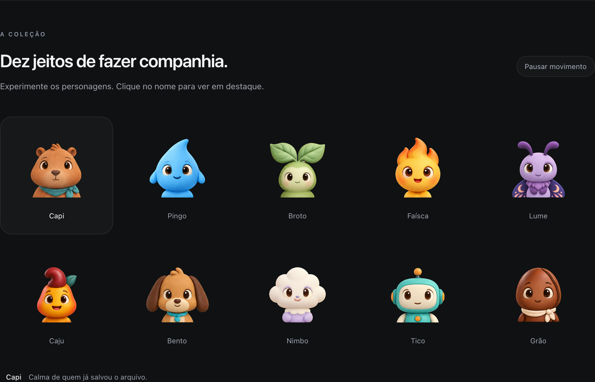
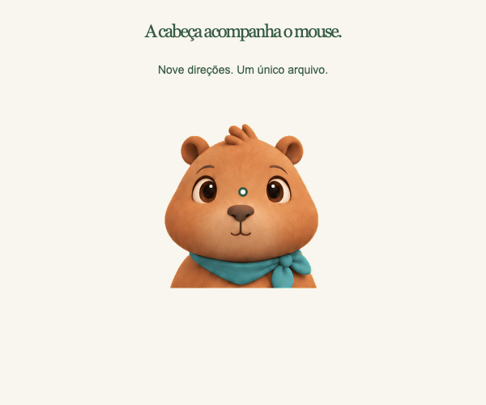

<div align="center">

# Mascote Cursor

### Seu site ganhou uma companhia.

Dez personagens que acompanham o mouse, recebem carinho e dão vida à sua página.
Feitos para você escolher — e para seu agente instalar.

**Em português · Artes próprias · Sem dependências no site · Licença MIT**



[Começar](#comece-por-aqui) · [Conhecer a turma](#conheça-a-turma) · [Ver funcionando](#quero-ver-funcionando) · [Criar o seu](#e-se-eu-quiser-um-mascote-só-meu)

</div>

## Um detalhe pequeno. Um site mais seu.

Sabe quando uma página tem um detalhe que faz você sorrir? É essa a ideia.

O **Mascote Cursor** coloca um personagem no seu site. A cabeça vira para acompanhar o mouse
em nove direções e, quando você clica, ele sorri e recebe um coração. No celular,
é só tocar. Também dá para interagir pelo teclado.



Ele fica no lugar que você escolher: ao lado do título, numa apresentação, no rodapé.
O nome é sobre o **cursor do mouse**: não é exclusivo do editor Cursor e não substitui
a setinha do sistema.

## Comece por aqui

**Você já tem um projeto aberto em um assistente de programação, como Cursor,
Claude Code ou Codex? Este é o caminho mais fácil.**

Uma _skill_ é um pequeno manual que ensina seu assistente a fazer uma tarefa. Esta
já inclui os personagens, o código e as instruções para integrar tudo no seu site.

### 1. Instale a skill

No terminal do seu projeto, execute:

```bash
npx skills add asimov-academy/mascote-cursor --skill mascote-cursor
```

Terminal é a área do editor onde você digita comandos. No Cursor, por exemplo, abra
o menu **Terminal → New Terminal**. O instalador pergunta em qual assistente colocar
a skill; escolha o que você usa. A instalação fica neste projeto por padrão.

O comando precisa de internet e de [Node.js 22 ou superior](https://nodejs.org/pt/download).
Instale uma versão LTS compatível se `npx` não for reconhecido e reabra o terminal.
Se o assistente não enxergar a skill logo depois, abra uma nova conversa.

### 2. Peça no chat

Copie este pedido:

```text
Use a skill mascote-cursor para colocar a Capi ao lado do título do meu site.
Integre os arquivos e confira se ela acompanha o mouse e reage ao clique.
```

Pronto: o agente identifica seu projeto, copia a arte escolhida, coloca o componente
na página e verifica a integração. **Você não precisa gerar imagens nem configurar
uma chave de API para usar os dez mascotes prontos.**

Se você já usa comandos de skills no seu assistente, pode invocar `mascote-cursor`
por esse caminho também. O pedido em português acima evita depender de um prefixo
específico de ferramenta.

### 3. Deixe do seu jeito

```text
Troque a Capi pelo Bento e deixe ele um pouco menor.
```

```text
Coloque a Lume no rodapé, sem cobrir o conteúdo da página.
```

```text
Adicione um botão para pausar o movimento do mascote.
```

O agente faz a mudança no projeto. O mascote continua sendo seu para editar.

## Conheça a turma

São **exatamente dez** personagens prontos, com direção visual de pequenas miniaturas
de argila e personalidades próprias.

| Mascote    | Quem é             | Seu jeito                                 | Nome no código |
| ---------- | ------------------ | ----------------------------------------- | -------------- |
| **Capi**   | Capivara           | Calma de quem já salvou o arquivo.        | `capi`         |
| **Pingo**  | Gotinha            | Uma boa ideia sempre puxa outra.          | `pingo`        |
| **Broto**  | Plantinha          | Pequenos começos, grandes possibilidades. | `broto`        |
| **Faísca** | Chaminha           | A energia de tirar uma ideia do papel.    | `faisca`       |
| **Lume**   | Mariposinha        | Curiosidade acesa até de madrugada.       | `lume`         |
| **Caju**   | Cajuzinho          | Um jeitinho brasileiro de ser diferente.  | `caju`         |
| **Bento**  | Vira-lata caramelo | Seu próximo projeto ganhou companhia.     | `bento`        |
| **Nimbo**  | Nuvem              | Cabeça nas nuvens. Ideias também.         | `nimbo`        |
| **Tico**   | Robozinho          | Um pouco de lógica, um tanto de afeto.    | `tico`         |
| **Grão**   | Grão de café       | Companheiro oficial do só mais um ajuste. | `grao`         |

Cada personagem já vem com **nove direções da cabeça e três expressões**, reunidas
em um único PNG de alta resolução. O componente mostra a pose certa conforme a posição do mouse.

## Quero ver funcionando

Baixe o repositório pelo botão **Code → Download ZIP** e extraia a pasta. Abra essa
pasta no seu editor, abra o terminal e execute:

```bash
npm run dev
```

Abra **[localhost:4173](http://localhost:4173)** no navegador. Você pode conhecer os
dez mascotes, testar o carinho e seguir o tutorial: acessar o GitHub, instalar a skill e só então pedir a integração ao agente.
Precisa de Node.js 22 ou superior; para a demonstração, **não precisa executar
`npm install`**. Para encerrar, use `Ctrl+C` no terminal.

Se preferir Git:

```bash
git clone https://github.com/asimov-academy/mascote-cursor.git
cd mascote-cursor
npm run dev
```

Já baixou e quer instalar a skill a partir dessa pasta?

```bash
npx skills add . --skill mascote-cursor
```

## Prefiro integrar manualmente

Não há um pacote npm deste projeto publicado. A distribuição é pelos arquivos
deste repositório, que você pode guardar junto do seu site.

**1.** Dentro da pasta deste repositório, copie o mascote para a pasta pública do seu site:

```bash
node skills/mascote-cursor/scripts/instalar.mjs --mascote capi --dest ../meu-site/public/mascote-cursor
```

Troque `../meu-site/public/mascote-cursor` pelo destino correto. O comando leva o motor,
a licença e somente a imagem escolhida. Ele não modifica sua página automaticamente.
Pode ser repetido: arquivos iguais são preservados, e arquivos diferentes não são sobrescritos.

**2.** Carregue o módulo e coloque a tag na sua página:

```html
<script type="module" src="/mascote-cursor/mascote.js"></script>

<mascote-cursor mascote="capi" tamanho="160"></mascote-cursor>
```

Esse exemplo pressupõe que `public/` é servido na raiz do site. Ajuste o prefixo da
URL se seu projeto for publicado em uma subpasta. Abra pelo servidor do projeto,
não dando dois cliques no HTML: módulos JavaScript precisam de HTTP.

O componente usa recursos nativos do navegador. Há orientações para **HTML, React,
Next.js, Vue, Svelte e Astro** no [guia de integração](skills/mascote-cursor/references/integracao.md).
Isso não exige migrar seu site para outra tecnologia.

| Quero mudar…   | Como fazer                                                       |
| -------------- | ---------------------------------------------------------------- |
| Personagem     | Instale a nova arte e troque `mascote="bento"`.                  |
| Tamanho        | Use `tamanho="120"`.                                             |
| Nome acessível | Use `rotulo="Fazer carinho em Bento"`.                           |
| Movimento      | Adicione `pausado`; remova o atributo para retomar.              |
| Posição        | Coloque a tag no layout desejado. Ela não flutua sobre a página. |
| Arte própria   | Use `atlas`, como no guia abaixo.                                |

## E se eu quiser um mascote só meu?

O processo é curto: **gere as poses → prepare com um comando → confira e coloque no site**.
Pode ser um personagem descrito por você ou uma arte baseada em uma referência sua.
Criar uma imagem nova depende da ferramenta de geração que você tiver disponível.

Peça ao agente:

```text
Use a skill mascote-cursor para criar um mascote original:
um biscoitinho redondo com uma mordida, em estilo de argila.
Depois coloque ele na minha página e confira o resultado.
```

Para ajustar visualmente, com a demonstração ligada abra o
**[revisor de poses](http://localhost:4173/demo/personalizar.html)**. Sua imagem fica
no navegador, sem upload. Você pode testar fundos claro/escuro e copiar a configuração.

O [guia de criação](skills/mascote-cursor/references/criar.md) explica o pedido de imagem,
o comando de preparação, a transparência e o alinhamento. Sua criação fica no seu projeto; a coleção pronta continua
com dez personagens.

## Por que é simples de replicar?

- **Um PNG por personagem.** As doze poses já vêm preparadas e alinhadas.
- **Uma skill completa.** O agente encontra instruções, arquivos e instalador no mesmo lugar.
- **Sem dependências de execução.** Não precisa React, biblioteca de animação, Python ou servidor próprio.
- **Uma cópia local.** Depois de integrado, o componente não depende de uma CDN nem faz chamadas de IA.
- **Cuidados já incluídos.** Teclado, toque, movimento reduzido, pausa e liberação de recursos.

A cabeça muda de perspectiva com poses desenhadas. O motor escolhe uma das nove
direções e evita tremor perto das fronteiras entre elas. Não é um modelo 3D contínuo.

**Já usava a versão 1?** Os nomes prontos continuam iguais. Atualize motor e PNGs juntos.
Artes próprias com `imagem` + `olhos` precisam virar uma folha de poses com `atlas`.
Veja a [migração](skills/mascote-cursor/references/criar.md#migração-da-versão-1).

## Perguntas rápidas

**Funciona só no Cursor?** Não. Cursor aqui é o ponteiro do mouse. A skill pode ser
usada em assistentes compatíveis, e o componente funciona no navegador.

**Preciso pagar por imagens?** Para os dez prontos, não há geração nem API.
O assistente de programação e a geração de personagens novos podem ter seus próprios custos.

**Funciona no celular?** Sim: o toque faz carinho. Acompanhamento do mouse é ativado
somente com ponteiro preciso e sem preferência por movimento reduzido.

**Posso usar comercialmente?** O código e as artes deste projeto são disponibilizados
sob a [licença MIT](LICENSE). Preserve a licença ao redistribuir. A origem das artes
está registrada em [autoria](docs/autoria.md).

**A imagem não apareceu.** Confira se o PNG está na pasta `mascotes/` ao lado de
`mascote.js`, se o nome está correto e se a página está sendo aberta por um servidor.
Veja mais situações no [guia de integração](skills/mascote-cursor/references/integracao.md#se-algo-não-aparecer).

## Para agentes e pessoas que querem contribuir

Comece por [AGENTS.md](AGENTS.md). A fonte do componente fica **dentro da própria skill**;
a demo usa exatamente esses mesmos arquivos. Não há versões paralelas para sincronizar.

```bash
npm ci
npx playwright install chromium webkit
npm run verificar
```

Os testes cobrem instalação, conflitos, catálogo, movimento, toque, teclado e falhas
de configuração. Playwright é usado apenas no desenvolvimento, não no site final.
Leia [como contribuir](docs/contribuir.md) e as [decisões do processo](docs/processo.md).

---

Criado para a comunidade da **Asimov Academy**. A ideia de um personagem que observa
o ponteiro tem como referência conceitual o [page-mascot](https://github.com/nilbuild/page-mascot).
Este projeto tem implementação, fluxo, documentação, prompts e artes próprios.
